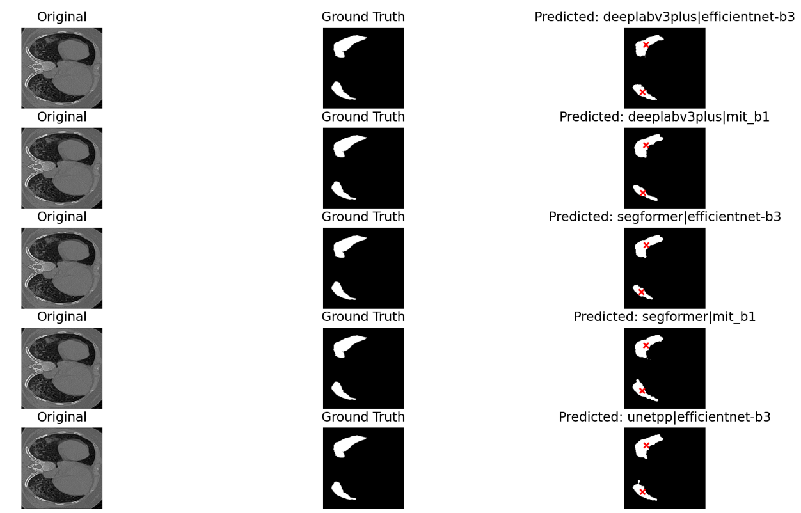
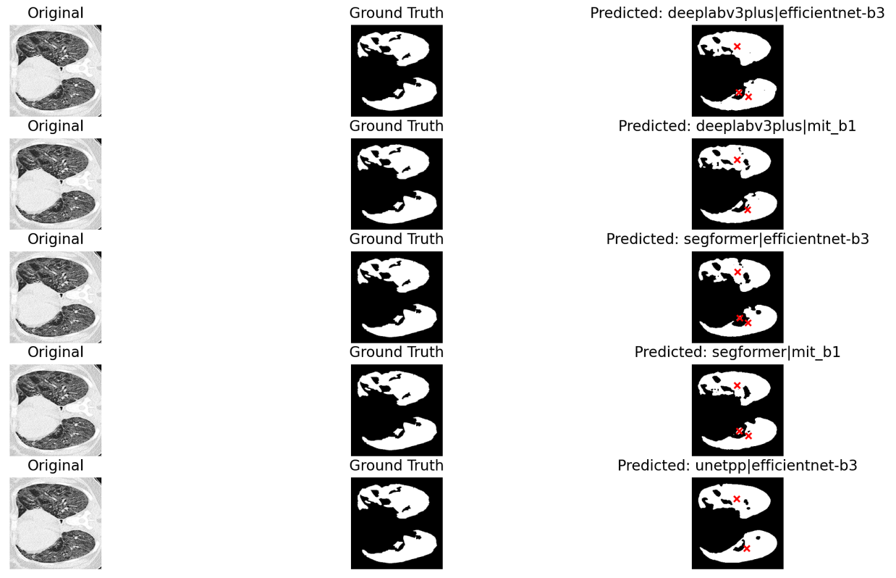
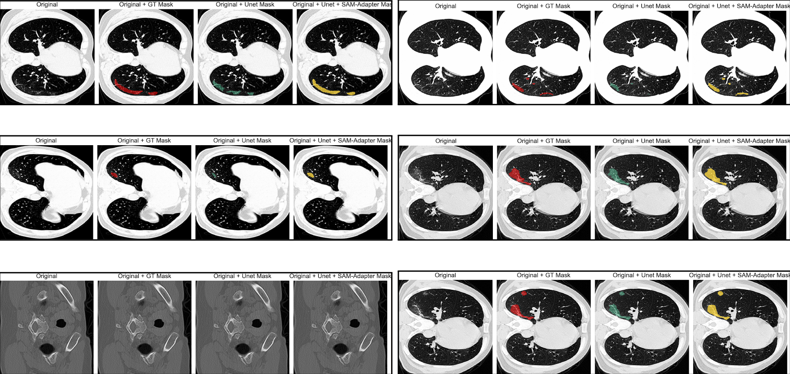
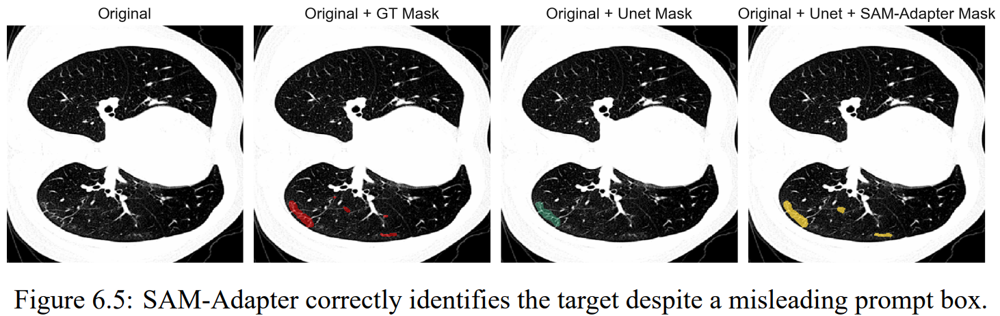

# Pneumonia DetectionCOVID-19 CT Scan Segmentation with U-net and SAM-Adapter

This repository contains code and datasets for semantic segmentation of COVID-19 CT scans, mainly **U-net** and testing if U-net + **SAM-Adapter** models improves lesion localization or not.

---

## Table of Contents

- [Project Overview](#project-overview)
- [Dataset](#dataset)
- [Pipeline](#pipeline)
- [Results](#results)

---

## Project Overview

This project helps detecting sub-Pneumonia data: COVID19. This was a brutal disease that took lives of so many people. Hard working people from around the world had dedicated their works to science: COVID19 lesion annotated masks.

This project aims to segment infection regions in COVID-19 CT scans. It leverages:

- **U-net**: baseline segmentation model with multiple varients (main)
- **SAM-Adapter**: improves mask quality using U-net-generated prompts (experimental)
- **Custom datasets** with lung ROI preprocessing and mask normalization. (pre run for better convergence and generalization)

Key features:

- Automatic cropping around lung regions using lung masks
- Data augmentation and normalization pipelines
- Support for multi-class or binary masks
- Overlay visualization for qualitative analysis

---

## Dataset

Datasets used:

- **COVID-19 CT scans**: [link](https://www.kaggle.com/datasets/andrewmvd/covid19-ct-scans)
- **Lung CT nodule/ Lesion Segmenbtation**: [link](https://www.kaggle.com/datasets/piyushsamant11/pidata-new-names)

The **Lung CT nodule/ Lesion Segmenbtation** is already in .PNG format, so we only need to process **COVID-19 CT scans**. This dataset contains .NII files so we need to convert them into .PNG, and all the functions can be found in To_PNG\nii_to_png.py

The processed dataset is divided into 3 subsets, 2 used for training and one for evaluation.

Preprocessing steps:

- Removal of duplicate slices
- Exclusion of slices with masks containing only background (~80%)
- Cropping to lung region (ROI)
- Normalization and mapping using **bone colormap**

> ⚠️ Some slices are low-quality or misleading; manual inspection may be required for best results.

---

## Pipeline

There are 2 pipelines. The main one is in folder **Segmentation** where I utilized Segmentation-Model-Pytorch to testify multiple U-net variants.

The experimental folder **SAM - CUS SAM** is where I testified 2 scenarios:

- My pre-trained SAM-Adapter vs Base SAM
- My pipeline U-net + SAM-Adapter vs Pure U-net

---

## Results

- Pure U-net:  
- U-net + SAM-Adapter:  

---
