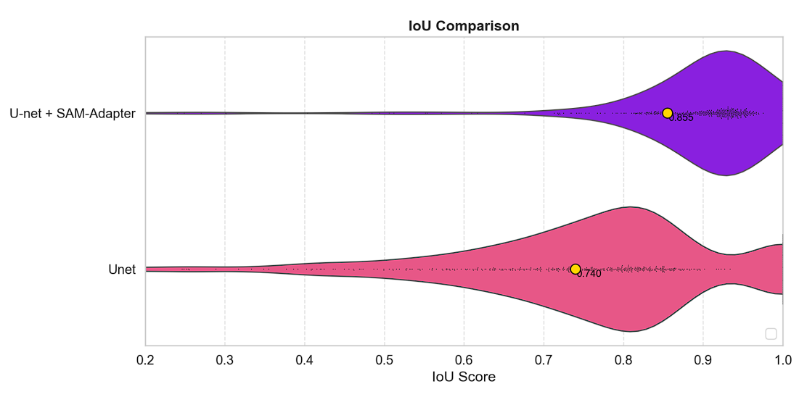
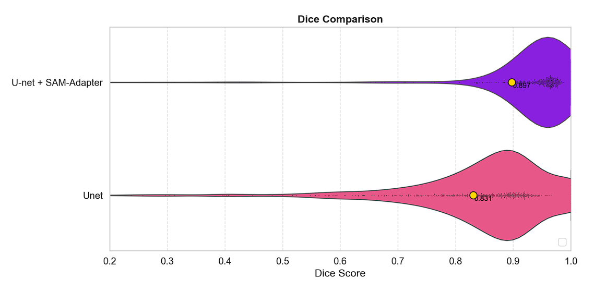
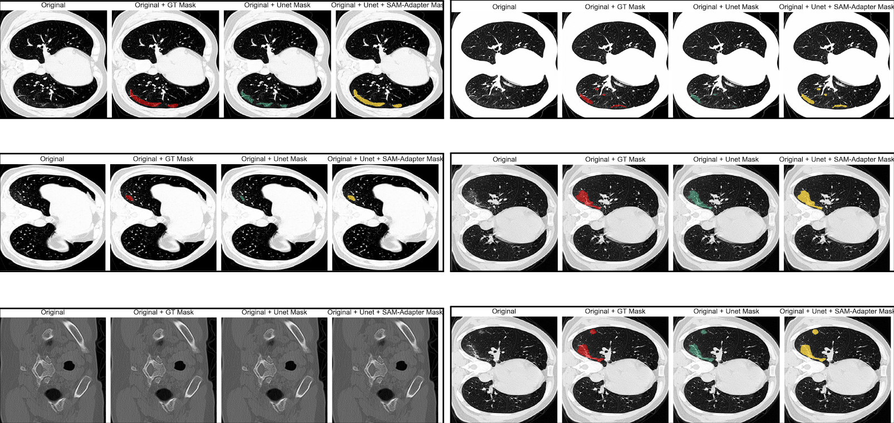
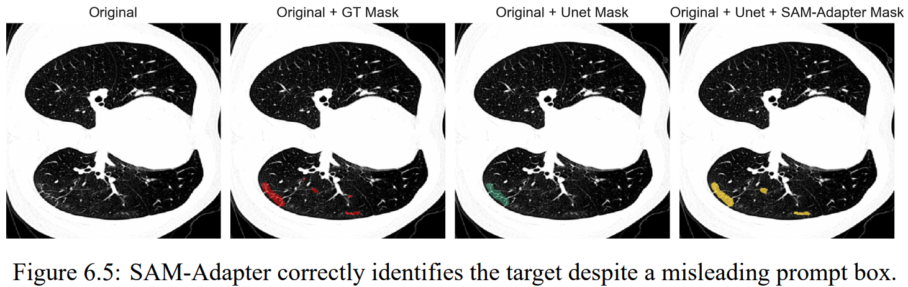

# Pneumonia DetectionCOVID-19 CT Scan Segmentation with U-net and SAM-Adapter

Benchmarking U-Net variants and a hybrid U-Net + SAM-Adapter pipeline 
for pneumonia-related lesion segmentation on COVID-19 CT scans.

---

## Results Summary

| Pipeline | IoU | Dice |
|---|---|---|
| U-Net++ (EfficientNet-B3) | 0.740 | 0.831 |
| U-Net + SAM-Adapter | **0.855** | **0.897** |

Hybrid pipeline achieves **+15.5% IoU gain** with tighter score 
distribution (see violin plots in `/images`).

---

## Table of Contents

- [Project Overview](#project-overview)
- [Dataset](#dataset)
- [Pipeline](#pipeline)
- [Results](#results)

---

## Overview

This project develops and benchmarks two segmentation pipelines for 
pneumonia-related lesion detection using COVID-19 CT scans as a proxy 
dataset (similar radiological characteristics to general pneumonia).

**Pipeline 1 — U-Net variants (main):**
Benchmarks 5 architectures (DeepLabV3+, SegFormer, U-Net++ with 
EfficientNet-B3/MiT-B1 encoders) using Segmentation Models PyTorch.

**Pipeline 2 — Hybrid U-Net + SAM-Adapter (experimental):**
U-Net generates initial masks → converted to bounding box prompts → 
SAM-Adapter refines boundaries. SAM-Adapter was manually constructed 
from Meta AI's codebase — no existing library supported it at the time.

Key design decisions:
- Recall-prioritized training to minimize false negatives 
  (missed lesions carry higher clinical risk than over-segmentation)
- Multi-dataset concatenation strategy for generalization 
  under limited pneumonia annotations
- Custom early stopping score: 
  `-0.25×train_loss - 0.25×val_loss + 0.5×mean_IoU`
- Loss functions: BCEDiceLoss, BCETverskyLoss, FocalLoss 
  (U-Net); FocalDiceIoULoss (SAM-Adapter)
  
---

## Dataset

| Dataset | Format | Usage |
|---|---|---|
| [COVID-19 CT scans](https://www.kaggle.com/datasets/andrewmvd/covid19-ct-scans) | .NII → .PNG | Training (2 subsets) + Evaluation |
| [Lung CT Nodule/Lesion Segmentation](https://www.kaggle.com/datasets/piyushsamant11/pidata-new-names) | .PNG | Domain-focused training (repeated 2×) |

**Preprocessing:**
- Convert NIfTI volumes to PNG axial slices (`To_PNG/nii_to_png.py`)
- Remove duplicate slices and ~80% background-only slices
- Crop to lung ROI using lung masks
- Normalize and map using bone colormap for intensity preservation
- Multi-dataset concatenation via PyTorch `ConcatDataset`

> ⚠️ Some slices are low-quality or misleading. 
> A classification filter for anomalous slices is recommended 
> but not implemented in current pipeline.

---

## Architecture

**U-Net variants** (via Segmentation Models PyTorch):
- DeepLabV3+ — EfficientNet-B3 / MiT-B1
- SegFormer — EfficientNet-B3 / MiT-B1
- U-Net++ — EfficientNet-B3 ← best trade-off, selected for SAM-Adapter

**SAM-Adapter** (manually implemented):
- Frozen ViT backbone (SAM base)
- Lightweight bottleneck + attention adapters inserted into 
  transformer layers
- Two-stage training: adapter fine-tuning → full decoder training 
  with iterative prompting
- Prompts: 1 bounding box (from U-Net mask) + random points 
  near foreground

**Ensemble methods** (U-Net pipeline):
- Soft voting: average predicted probabilities across models
- IoU-weighted voting: weight each model by validation IoU score

---

## Results

- **U-net Variants Predictions:** .png>) .png>) .png>)
- **Pipeline ablation — violin plots (IoU & Dice):**  
- **Pipeline ablation — U-net + SAM-Adapter Predictions:**  

---

## Report

Full thesis report available: [thesis_report.pdf](paper/thesis_report.pdf)

---

## Hardware
- GPU: NVIDIA RTX 3060
- Training time: ~50 min / 10 epochs (SAM-Adapter, num_workers=0)
